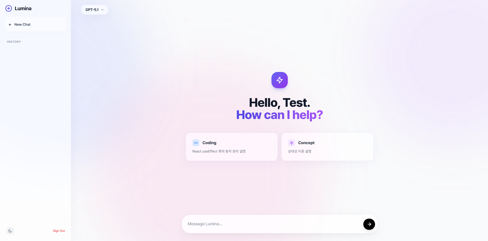
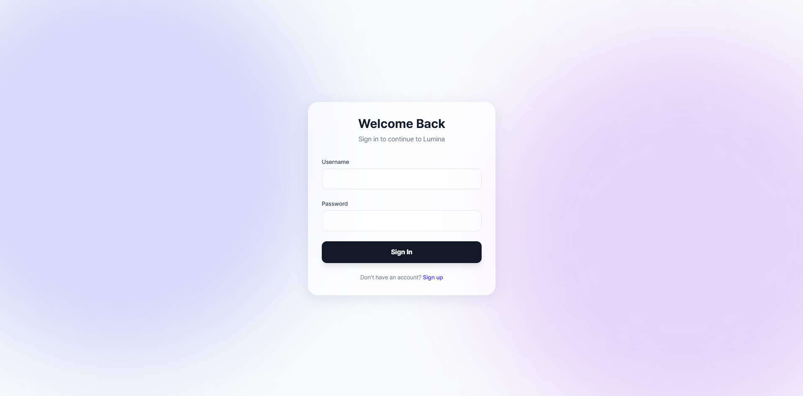
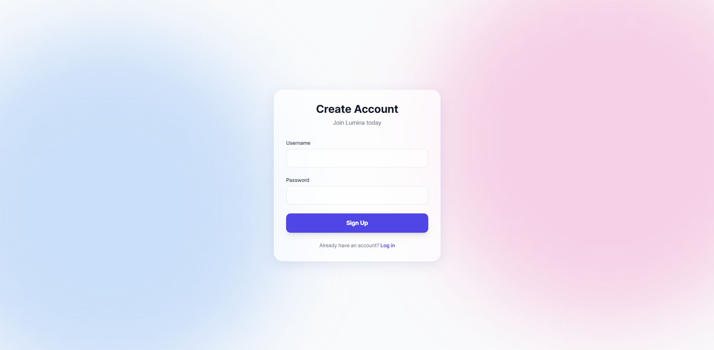
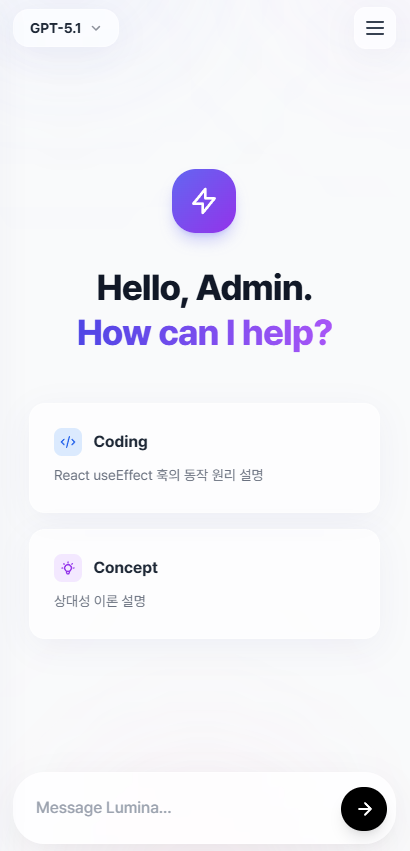
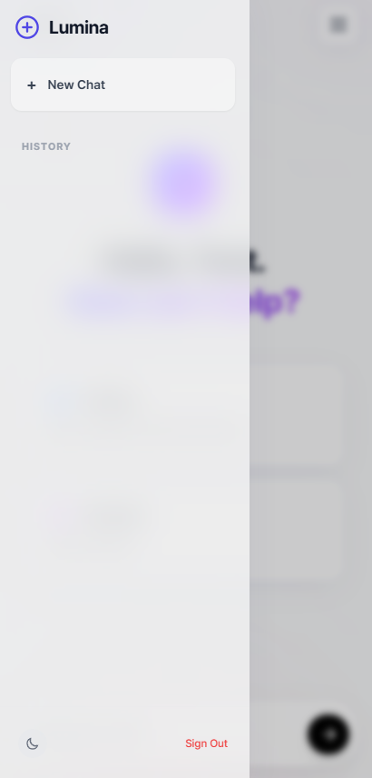

# Lumina Chat ⚡
An open-source web interface to chat with multiple LLMs.

## LLM Provider 
We use OpenAI API for the LLM.

### Use of Tor
We use Tor for sending requests to the provider because it has `150 Requests Per Day`. You might have to change the proxy port in `app.py` according to your use of Tor.
- When using Tor Browser, use `socks5h://127.0.0.1:9150` after installing the browser in Windows.
- When using Tor in Linux, use `socks5h://127.0.0.1:9050` after doing the following:
    - `sudo apt update`
    - `sudo apt install tor -y`  

If you're using OpenAI API as the provider, you may not use any proxy.

## Login & Signup
The login and signup data are saved as JSON file in `data` folder.  
The screenshot of login and signup page are like the follwing.

   

## Responsive Design
We designed this website to be responsive, giving users in desktop and mobile a good experience in both UI and UX.  

   